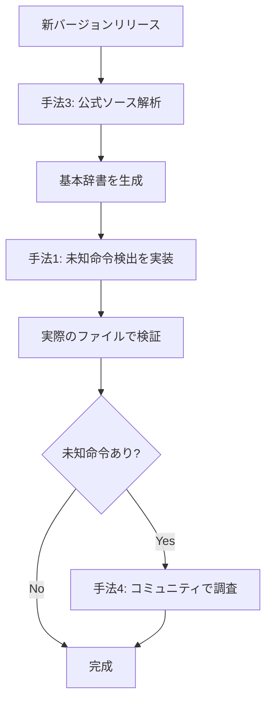
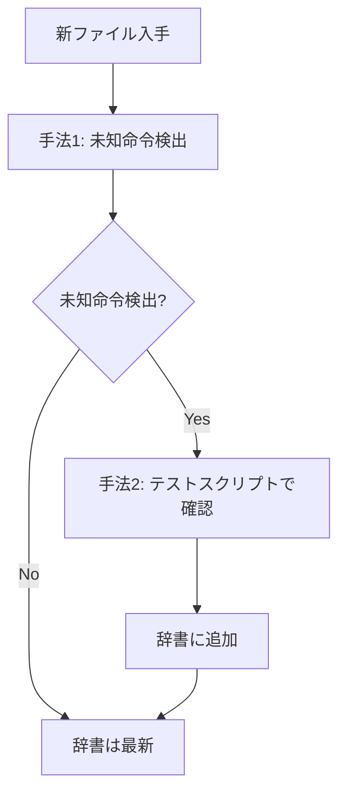

# Dictionary.csv 新バージョン対応ガイド

HSPの新しいバージョンに対応したDictionary.csvを作成するための包括的なガイドです。

## 概要

このドキュメントでは、HSPの新バージョン（例: 3.6, 3.7など）に対応したDictionary.csvを作成する4つの手法を解説しています。

## Dictionary.csvとは

Dictionary.csvは、HSPデコンパイラが.axファイル（HSPのバイトコード）を逆コンパイルする際に使用する辞書ファイルです。

### 構造

```csv
#HSP Ver.3.5beta4用
#Keys,,Values,,
#TypeCode,ValueCode,Name,Type,ExtraFlag
$Code
0x08,0x0011,exist,HspFunction,
0x08,0x0012,delete,HspFunction,
0x09,0x0010,title,HspFunction,
...
$End
```

### 役割

- **TypeCode + ValueCode**: HSPバイトコード内の命令識別子
- **Name**: 命令名（例: `mes`, `button`, `if`）
- **Type**: 命令タイプ（例: `HspFunction`, `Operator`）
- **ExtraFlag**: 追加情報（例: `Priority_2`）

## 4つの手法

### [手法1: 未知命令検出機能](method1-unknown-code-detection.md)

**推奨度**: ★★★★★
**難易度**: ★★☆☆☆
**自動化**: ★★★★★

デコンパイラ自体に未知命令を自動検出・記録する機能を追加し、新バージョンの.axファイルから新規命令を抽出します。

#### メリット
- 実装すれば完全自動化
- 実際に使われている命令のみを検出
- 複数ファイルから一度に情報収集

#### デメリット
- コード実装が必要
- 命令名の特定は別途必要

#### 適用シーン
- 新バージョンのHSPファイルが手に入ったとき
- 大量のファイルを効率的に解析したいとき
- 継続的なメンテナンスのため

---

### [手法2: テストスクリプト解析法](method2-test-script-analysis.md)

**推奨度**: ★★★★☆
**難易度**: ★★★☆☆
**自動化**: ★★★☆☆

全命令を網羅したテストスクリプトをコンパイルし、バージョン間のバイトコードを比較分析します。

#### メリット
- 体系的・網羅的
- バージョン間の差分が明確
- 自動化可能

#### デメリット
- テストスクリプト作成の手間
- 各バージョンのHSPコンパイラが必要
- 初期セットアップが複雑

#### 適用シーン
- 複数バージョンを体系的に比較したいとき
- 確実にすべての命令を検証したいとき
- バージョン管理を厳密に行いたいとき

---

### [手法3: HSP公式ソースコード解析法](method3-official-source-analysis.md)

**推奨度**: ★★★★★
**難易度**: ★★★★☆
**自動化**: ★★★★☆

OpenHSPのソースコードから命令定義テーブルを直接抽出し、Dictionary.csvを生成します。

#### メリット
- 最も正確
- 完全に網羅的
- バージョン管理が容易（Git）

#### デメリット
- C++コードの解析が必要
- パーサーツールの作成が必要
- HSPの内部構造理解が必要

#### 適用シーン
- 最も正確な情報が必要なとき
- プログラミングに慣れているとき
- 長期的なメンテナンスを考えるとき

---

### [手法4: コミュニティ情報収集法](method4-community-info-gathering.md)

**推奨度**: ★★★☆☆
**難易度**: ★☆☆☆☆
**自動化**: ★☆☆☆☆

公式ドキュメント、コミュニティ、既存ツールから情報を収集します。

#### メリット
- 技術的ハードルが低い
- 実用例やTips付き
- 日本語情報が豊富

#### デメリット
- 手作業が多い
- 情報の正確性検証が必要
- 網羅性に欠ける可能性

#### 適用シーン
- 他の手法の補完として
- 特定の命令だけ調査したいとき
- プログラミングに不慣れなとき

## 推奨ワークフロー

### 初めて新バージョンに対応する場合



### 継続的なメンテナンスの場合



## クイックスタートガイド

### 1. 未知命令検出機能を実装（推奨）

```bash
# 1. コードを追加（手法1参照）
# 2. ビルド
dotnet build

# 3. 新バージョンのファイルで実行
HSPdecom.exe --log-unknown new_version.ax

# 4. 生成されたログを確認
cat unknown_codes.csv
```

### 2. OpenHSPから辞書を生成

```bash
# 1. OpenHSPをクローン
git clone https://github.com/onitama/OpenHSP.git

# 2. 抽出スクリプトを実行
python extract_commands.py OpenHSP

# 3. 生成された辞書を確認
head Dictionary_extracted.csv
```

### 3. 既存辞書と比較

```bash
# バージョン間の差分を確認
diff Dictionary_old.csv Dictionary_new.csv > differences.txt

# 追加された命令を抽出
grep '^>' differences.txt
```

## ツールとユーティリティ

### 辞書マージツール（開発予定）

```csharp
// DictionaryMerger.cs
// 複数の辞書ファイルを自動的にマージ

DictionaryMerger.Merge(
    oldDictionary: "Dictionary_3.5.csv",
    newCodes: "unknown_codes.csv",
    output: "Dictionary_3.6.csv"
);
```

### バージョン検出機能（開発予定）

```csharp
// 自動的にHSPバージョンを検出し、適切な辞書を選択
string version = HspVersionDetector.Detect(axFilePath);
string dictPath = $"Dictionary_{version}.csv";
```

## ディレクトリ構成（推奨）

```
HSP-Decompiler/
├── Dictionary.csv                  # 現在使用中の辞書
├── Dictionaries/
│   ├── Dictionary_3.4.csv          # HSP 3.4用
│   ├── Dictionary_3.5b4.csv        # HSP 3.5beta4用
│   ├── Dictionary_3.6.csv          # HSP 3.6用
│   └── README.md                   # 各辞書の説明
├── Tools/
│   ├── BytecodeDumper.exe          # バイトコード解析
│   ├── CommandExtractor.py         # OpenHSPから抽出
│   └── DictionaryMerger.exe        # 辞書マージ
├── TestScripts/
│   ├── test_basic.hsp              # 基本命令テスト
│   ├── test_extended.hsp           # 拡張命令テスト
│   └── compile_all.ps1             # 一括コンパイル
└── claudedocs/                     # このドキュメント
    ├── README.md                   # このファイル
    ├── method1-unknown-code-detection.md
    ├── method2-test-script-analysis.md
    ├── method3-official-source-analysis.md
    └── method4-community-info-gathering.md
```

## FAQ

### Q1: どの手法から始めるべき？

**A**:
- プログラミング経験あり → 手法1（未知命令検出）を実装
- 正確性重視 → 手法3（公式ソース解析）
- 手軽に始めたい → 手法4（コミュニティ情報収集）

### Q2: 複数の手法を組み合わせるべき？

**A**: はい、推奨します。例:
1. 手法3で基本辞書を作成
2. 手法1で実ファイルから補完
3. 手法4で不明点を調査

### Q3: 辞書ファイルのバージョン管理は？

**A**:
```bash
# Gitでバージョン管理
git add Dictionaries/Dictionary_3.6.csv
git commit -m "Add HSP 3.6 dictionary"
git tag v3.6-dict
```

### Q4: TypeCode/ValueCodeが分からない

**A**:
1. 手法1の未知命令検出で自動取得
2. 手法2のバイトコード比較で特定
3. 手法3の公式ソースから確認

### Q5: 命令名が分からない

**A**:
1. HSPヘルプ（hsphelp.chm）で調査
2. コミュニティに質問
3. テストスクリプトで動作確認

## トラブルシューティング

### 問題: 辞書読み込みエラー

```
Error: Dictionary.csvの読込に失敗しました
```

**解決策**:
1. ファイルのエンコーディングを確認（Shift-JIS）
2. CSVフォーマットの検証
3. $Code/$End の対応を確認

### 問題: 未知命令が多すぎる

**解決策**:
1. 辞書が古い可能性 → 手法3で最新辞書を生成
2. プラグイン命令 → プラグイン辞書を追加
3. 破損ファイル → 別のファイルで確認

### 問題: バージョン検出ができない

**解決策**:
1. .axヘッダーにはバージョン情報がない
2. ファイル名やメタデータから推測
3. ユーザーに選択させる

## 貢献・フィードバック

このドキュメントや手法について、改善案や追加情報があればGitHub Issuesでお知らせください。

## 参考リンク

- [HSP公式サイト](https://hsp.tv/)
- [OpenHSP GitHub](https://github.com/onitama/OpenHSP)
- [HSPTV!掲示板](https://hsp.tv/bbs/)
- [このプロジェクトのREADME](../README.md)

## ライセンス

このドキュメントはプロジェクトのライセンスに従います。

---

**作成日**: 2025-11-07
**最終更新**: 2025-11-07
**バージョン**: 1.0
